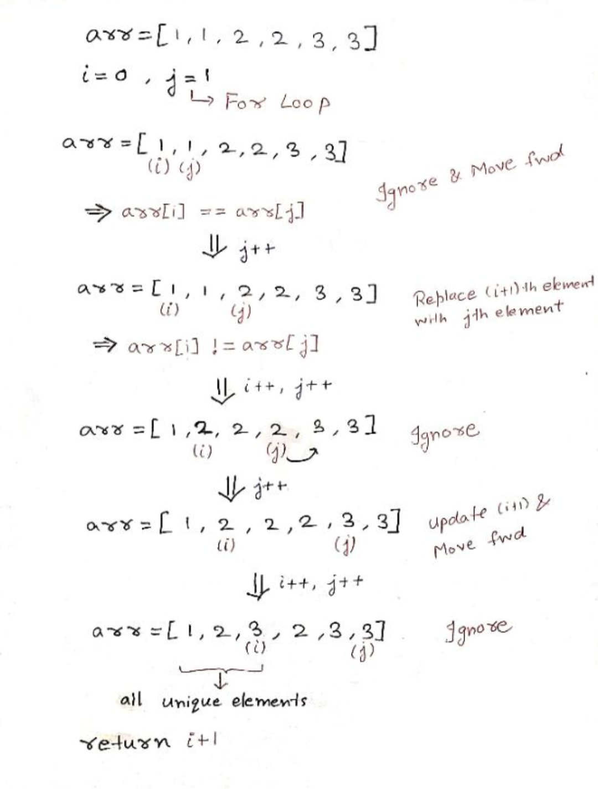

# Remove Duplicates

[LeetCode](https://leetcode.com/problems/remove-duplicates-from-sorted-array/)

Return no of unique elements in the array and place them in the starting of given array


## Brute force appraoch :-

* Create a Set data structure and insert all the elements in it
```cpp
set<int> st;
for(int i = 0; i < n; i++) {
    st.insert(arr[i]);
}
```
* After that, iterate over the set and place all the elements at the start of the array and return the no of elements placed

```cpp
int index = 0;
for(auto it : st) {
    arr[index] = it;
    index++;
}
return index;
```

### Complexity
<strong>Time: </strong><br> O(NLogN) for the insertion in the set<br>
O(N) for iterating over the set<br>
<br>
Overall: O(NLogN) + O(N)

<b>Space: </b> <br>
O(N) space is reqd for the set

## Optimal approach :-

<strong>Using 2 pointer appraoach</strong>

* take a variable ```i``` and point it to 0th index
* Iterate over the array using a variable ```j``` starting from the index 1 of the array
* Now go and look for distince elements in the array
* ```if(arr[i] == arr[j])``` -> ignore and move forward in the array, dont update ```i```
* ```if(arr[i] != arr[j])``` -> reaplace ```(i + 1)th``` element in the array with ```arr[j]```, and increase ```i``` by 1




``` cpp
int i = 0;
int n = nums.size();
for(int j = 1; j < n; j++) {
    if(nums[j] != nums[i]) {    
        nums[i + 1] = nums[j];  //Update (j + 1)th element
        i++;        //Increase i by 1
    }
}
return j + 1;
```