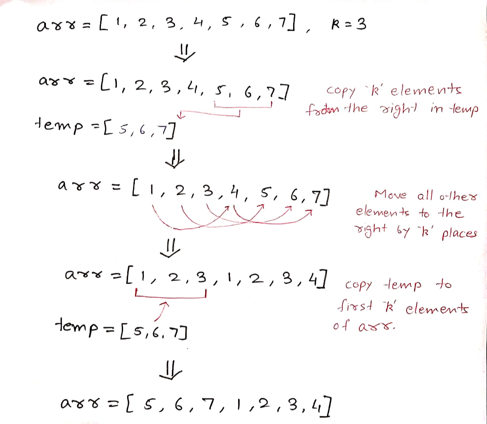
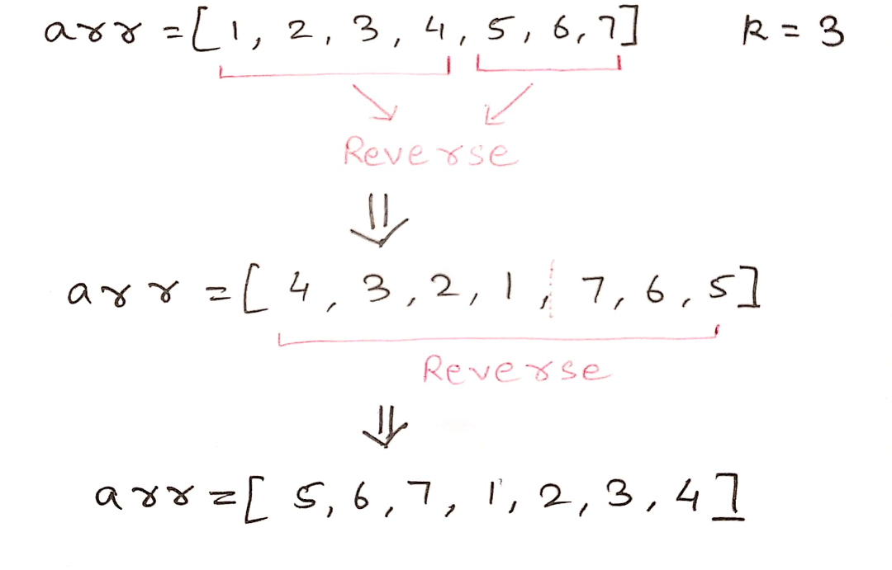

# Rotate an array by D places

Right rotate the array by k places <br>
<b>Input:</b> nums = ```[1,2,3,4,5,6,7]```  ```k = 3``` <br>
<b>Output:</b> ```[5,6,7,1,2,3,4]```

## Brute Force Approach :-

* Take a temporary array of size ```k```
* Store k elements from the right in the temporary array
* move each element to the right by k places starting from the rightmost element till the first element of the array
* copy the elements from the temporary array to the first ```k``` places of the array




### Complexity

<strong>Time: </strong> <br>
O(k) to store elements to temp + O(n - k) to shift + O(k) to copy back from temp

Overall: O(n + k)

<strong>Space: </strong> <br>
O(k) for the temporary array

## Optimal Approach :-

* Reverse k elements from the last
* Reverse n - k elements from the front
* Reverse the entire array



### Complexity

<strong>Time: </strong> <br>
O(k) to reverse last k elements <br>
O(n - k) to reverse first n - k elements <br>
O(n) to reverse the entire array

Overall:  O(2N)

<strong>Space: </strong> O(1)